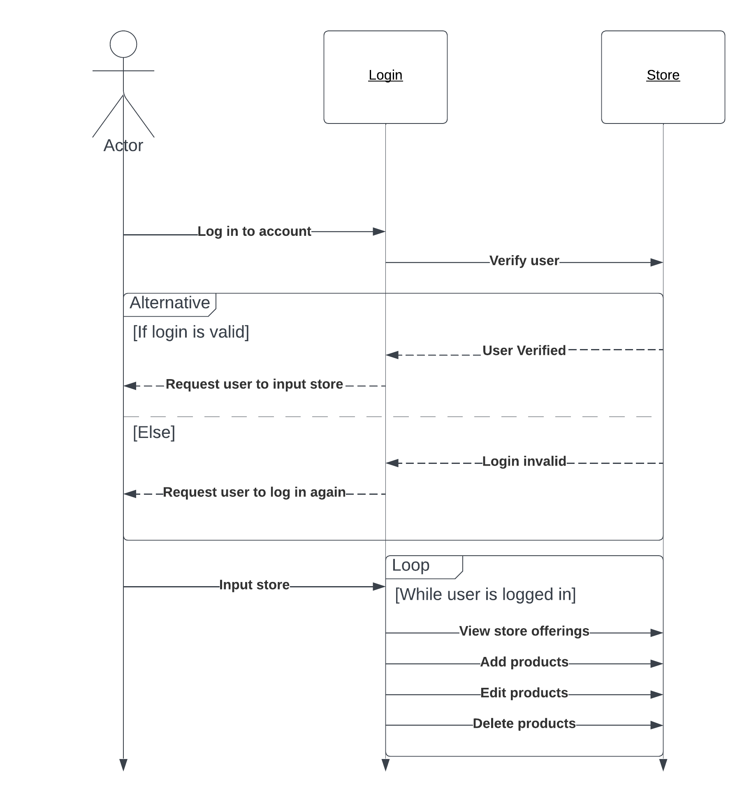

## 1 Design Considerations
### 1.1 Assumptions
- Users will have an Android smartphone or tablet with the required specifications to run the app.
- Users will be able to understand the instructions and information presented in the app in English.

### 1.2 Constraints
- The app must be designed to run on Android operating system versions 21 and higher.
- User data cannot be transferred to other mobile devices.
- The app must be optimized to run on a variety of screen sizes and resolutions.

### 1.3 System Environment
- The application is going to run on Android with a required system version (API) of 21: Lollipop.

## 2 Architectural Design
### 2.1 Component Diagram
- Since this is a static app, it just uses regular components included in the android development environment.

### 2.2 Deployment Diagram
- The system will be deployed on Android devices.

## 3 Low-Level Design
### 3.1 Class Diagram

### 3.2 Other Diagrams

## 4 User Interface Design
*For GUI-based systems, this section should provide the specific format/layout of the user interface of the system (e.g., in the form of graphical mockups).*
- Menu's on the bottom of the app that users can interact with(Product list, Stores, Profile)
- Stores will be shown in the center as the main options
- Left side will contain the Product list
- Right side will contain User Profile and Settings(Note in the alpha version it will just have a simple about the app message)
 - On the Product Lists and Stores tab there will contain a searching mechanism(Think like Amazon!) with the ability to filter searche
- 
- 
- 
